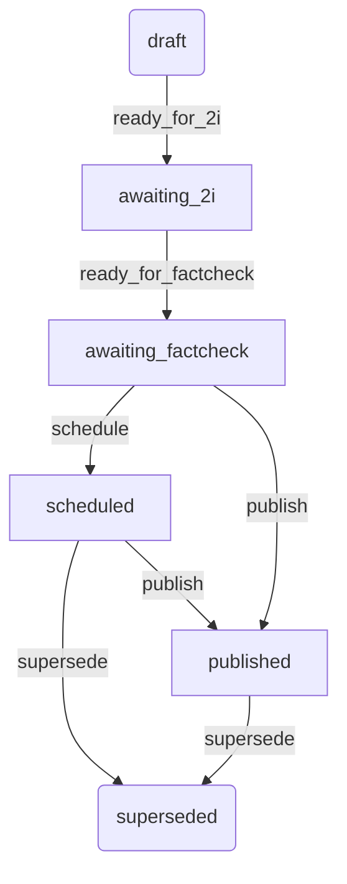

# Edition States

## Proposed State Diagram

## Notes

There are no backwards transitions in this model. If a user makes edits to a Published or Scheduled Edition, we
simply create a new Edition in the default (`draft`) state.

A user may propose a schedule for an edition in any state before `scheduled` or `published`. Once the Edition has
undergone all the review stages, it will be scheduled for publication. This means, for example, that a user may propose
a schedule for an Edition in the `draft` state but the state itself does not change.

## States

### draft

The default state for a new edition when created.

### awaiting_2i

Once the author has completed their work, they can request that a 2i Review (second pair of eyes) be performed.

### awaiting_factcheck

Once the 2i Review has been completed, the author can request that a fact check be performed.
This is usually done by a Subject-Matter Expert.

### scheduled

Once the Edition has gone through the whole review process, it can be scheduled for publication.

### published

Once the Edition has been published, it is no longer editable. Moving an Edition to this state pushes it live for users.

### superseded

When a user makes an edit to a Scheduled or Published Edition, the original Edition is marked as superseded.

## Transitions

### ready_for_2i

Mark an Edition as ready for 2i Review.

### ready_for_factcheck

Mark an Edition as ready for fact check.

### schedule

Schedule an Edition for publication.

### publish

Publish an Edition to the Publishing API.
